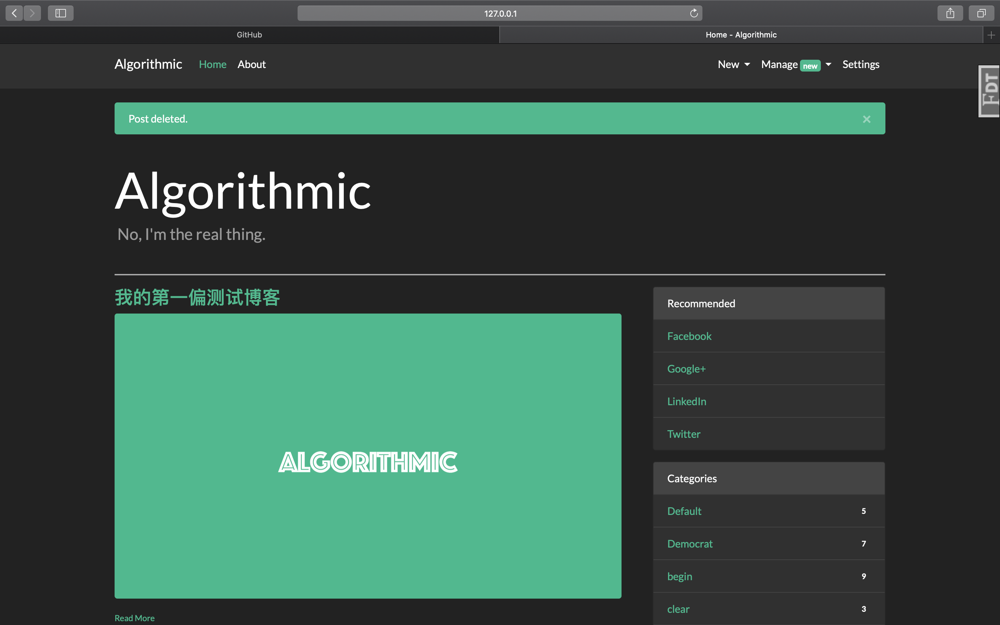
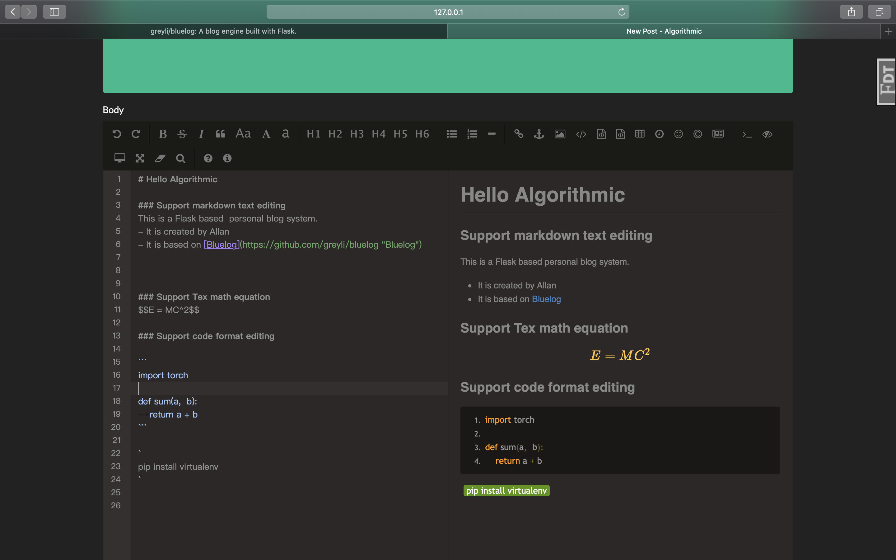

# Algorithmic

*A personal blog system based on Flask*

Please visit https://www.algorithmic.cn to see how it looks like.

NOTE:  
> Most of the codes are based on the
> Example application for 
>*[Python Web Development with Flask](http://helloflask.com/en/book)* (《[Flask Web 开发实战](http://helloflask.com/book)》).
>which is created by [Grey Li](https://greyli.com)

The Demo of the book above is here: http://bluelog.helloflask.com If you want to learn Flask, it is highly recommended
that you read this book! 


Algorithmic has some differences between Bluelog:

- There is a cover images for each post article.



- The editor of the post are a markdown editor based on [EditorMD](https://github.com/pandao/editor.md), 
While Bluelog uses a WYSIWYG editor named "CK_Editor".



## Installation

clone:
```
$ git clone https://github.com/crissallan/Algorithmic.git
$ cd Algorithmic
```
create & activate virtual env then install dependency:

with venv/virtualenv + pip:
```
$ virtualenv venv
$ source venv/bin/activate 
$ pip install -r requirements.txt
```

generate fake data then run:
```
$ flask forge
$ flask run
* Running on http://127.0.0.1:5000/
```

Test account:

* username: `admin`
* password: `helloflask`

## Deployment
To deploy the blog system on a Linux server, it is recommended to use Gunicorn + Nginx. 

## License

This project is licensed under the MIT License (see the
[LICENSE](LICENSE) file for details).

## Acknowledgement
Many thanks to [Grey Li](https://greyli.com) for sharing his Bluelog demo and his amazing book
《[Flask Web 开发实战](http://helloflask.com/book)》.

At the same time, I would appreciated [weiziyoung](https://wzy-codify.com/) and [Mike.Zhou](https://miketech.it/)
for teaching me a lot of things about Web Development.